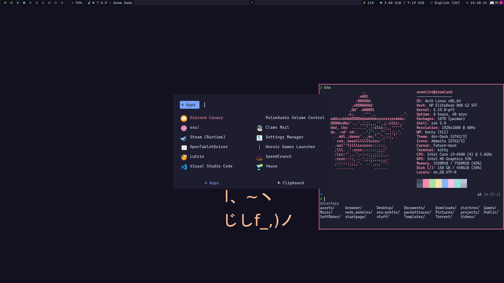
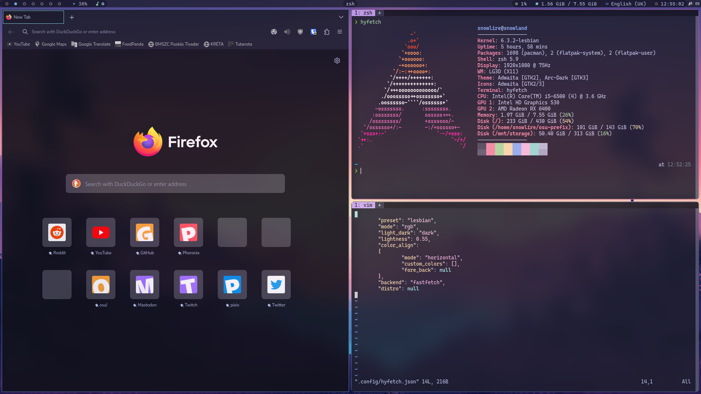

# dotfiles

My personal dotfiles. Changes come as I find interesting things to add.

- WMs: 
  - [Berry](https://berrywm.org/)
  
  - [Bspwm](https://github.com/baskerville/bspwm)
  
- Compositor: [Picom](https://github.com/jonaburg/picom)
- Bar: [Polybar](https://github.com/polybar/polybar)
- Application Launcher: [Rofi](https://github.com/davatorium/rofi)
  - Clipboard management: [Clipmenu](https://github.com/cdown/clipmenu)
  - [Kaomoji](https://github.com/heyrict/kaomoji-rofi)
- Notification: [Dunst](https://dunst-project.org/)
- Terminal Emulator: [Kitty](https://sw.kovidgoyal.net/kitty/)
  - Shell: [ZSH](https://www.zsh.org/)
  - Plugin manager: [Antidote](https://getantidote.github.io/)
  - Prompt: [P10K](https://github.com/romkatv/powerlevel10k)
- Music Player: [MPD](https://www.musicpd.org/) with [Ymuse](https://github.com/yktoo/ymuse)
- Color Scheme: [Catppuccin](https://github.com/catppuccin/catppuccin)
- Font: [Delugia Code](https://github.com/adam7/delugia-code)

### Other stuff that I use:
- [Flameshot](https://github.com/flameshot-org/flameshot)
- [Nitrogen](https://github.com/l3ib/nitrogen)
- [IBus](https://github.com/ibus/ibus)
